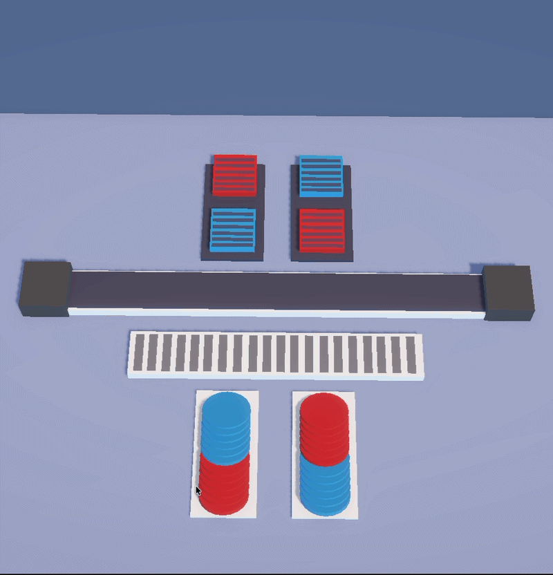
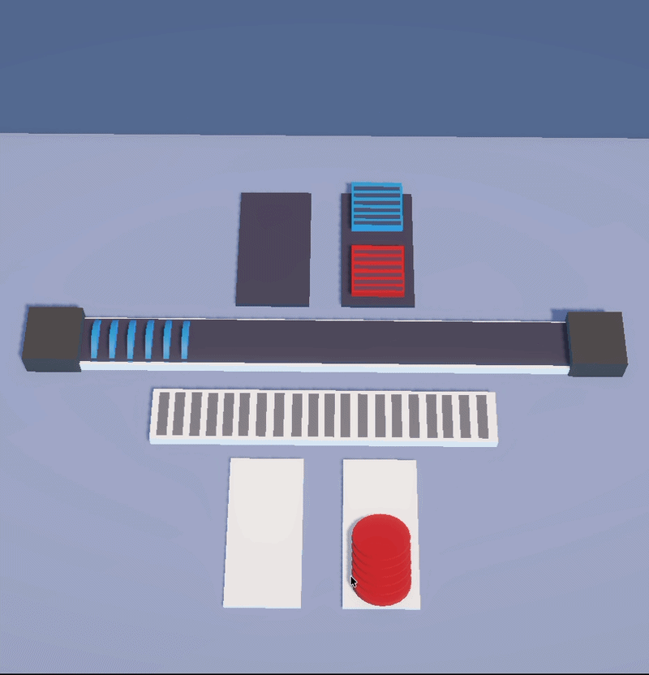

# Conveyor Belt System – Unity

A conveyor belt mechanic game built in Unity in ~3.5 hours.

## How It Works

- **Stack Holder** — holds stacks of colored items. Click any item to dispatch the whole stack to the belt.
- **Conveyor Belt** — moves items from start to end point, one by one as they land.
- **Container Holder** — containers lined up along the belt. Each container accepts only matching colored items and destroys itself when full.
- **Overfill Holder** — catches items nobody picked up. Click to re-dispatch them back onto the belt.

## Built With

- Unity
- DOTween
